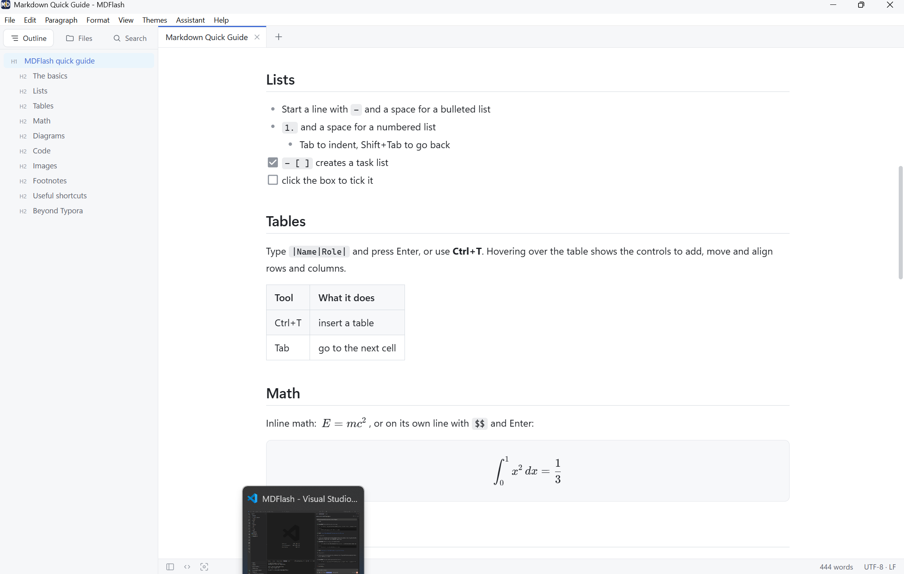
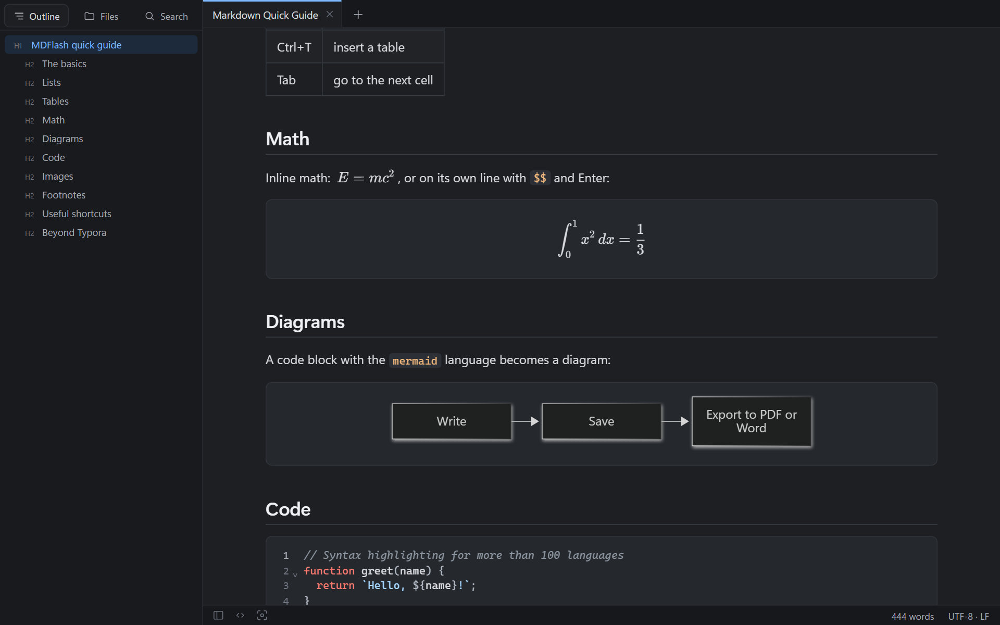
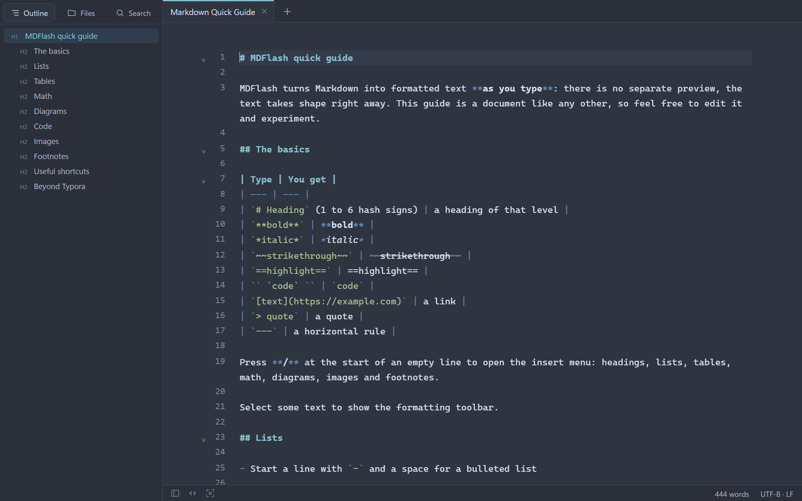
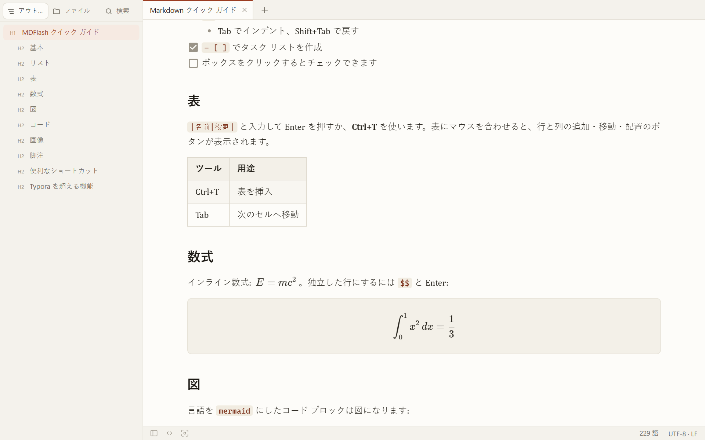

<p align="center">
  <picture>
    <source media="(prefers-color-scheme: dark)" srcset="docs/screenshots/hero-dark.png">
    
  </picture>
</p>

<h1 align="center">
  <br>
  MDFlash
</h1>

<p align="center">
  <b>A fast WYSIWYG Markdown editor for Windows, written in C.</b><br>
  Write Markdown and see it formatted as you type: no split preview, no clutter.
</p>

<p align="center">
  <a href="https://github.com/ShinRalexis/MDFlash/releases/latest"></a>
  
  
  
  <a href="LICENSE.txt"></a>
  <a href="https://liberapay.com/MetaDarko/donate"></a>
</p>

<p align="center">
  <a href="https://github.com/ShinRalexis/MDFlash/releases/latest/download/MDFlash-Setup-2.0.0.exe"><b>⬇ Download MDFlash for Windows</b></a>
  &nbsp;·&nbsp; 5 MB installer &nbsp;·&nbsp; no administrator rights needed
</p>

---

## Why MDFlash

- **It feels like Typora.** Headings, lists, tables, math and diagrams take shape where you type them. Press **Ctrl+U** whenever you want the raw Markdown.
- **It is small and native.** A 260 KB C program drives Microsoft Edge's WebView2 engine, which Windows already ships. No 150 MB Electron bundle.
- **It respects your files.** Opening a document never rewrites it. Line endings, encoding, front matter, `[[wiki links]]` and image descriptions are preserved when you save.
- **It goes further.** Tabs, version history, folder-wide search, an offline writing assistant and native Word export are built in.

## Features

### Writing

- Seamless live editing (WYSIWYG) and a source mode with syntax highlighting
- GitHub Flavored Markdown: tables with alignment, task lists, strikethrough, footnotes, autolinks
- Math with KaTeX (`$...$` and `$$...$$`) and diagrams with Mermaid
- Code blocks with syntax highlighting for more than 100 languages
- `==highlight==` and Obsidian-style `[[wiki links]]`: Ctrl+click opens or creates the note
- YAML front matter kept intact and editable in its own box
- Press `/` on an empty line for a menu of headings, lists, tables, math, diagrams, images and footnotes
- Paste or drop images: they are copied next to the document and linked with relative paths

### Organizing

- Tabs, session restore and automatic recovery of unsaved text after a crash
- **Version history**: a copy on every save, with a line-by-line diff and one-click restore
- Sidebar with document outline, folder tree (new, rename, duplicate, move to Recycle Bin) and full-text **search across a whole folder**
- Quick open (Ctrl+P), command palette (Ctrl+Shift+A), find and replace with regular expressions
- Changes made by other programs are detected and reloaded

### Focus

- Focus mode (F8) dims everything except the paragraph you are writing
- Typewriter mode (F9) keeps the current line in the middle of the screen
- Live word, character and reading-time count, with an optional word goal

### Export and import

- **PDF**, **HTML** (styled or plain) and **Word (.docx)** with no extra software
- ODT, RTF, EPUB, LaTeX, reStructuredText and MediaWiki through [Pandoc](https://pandoc.org) when installed
- Copy as Markdown or as formatted HTML for e-mail and Word
- Import Word, HTML and CSV (more formats with Pandoc)

### Offline writing assistant

- With [Ollama](https://ollama.com) running locally, press **Ctrl+J** to fix, improve, shorten, expand, summarize, translate or rewrite the selected text
- Answers stream in as they are written; replace the selection, insert below or copy
- Your text never leaves your computer

### Look and feel

- Six themes (GitHub, Paper, Sepia, Academic, Night, Nord) plus your own CSS themes
- Follows the Windows light and dark setting; the native menu bar turns dark too
- Interface in **English, Italian, Spanish, French, German, Japanese, Korean, Chinese and Russian**, picked automatically from Windows (View > Language to change it)

## Screenshots

| Night theme with math and diagrams | Source mode (Nord theme) | Japanese interface (Paper theme) |
| :---: | :---: | :---: |
|  |  |  |

## Install

1. Download **[MDFlash-Setup-2.0.0.exe](https://github.com/ShinRalexis/MDFlash/releases/latest/download/MDFlash-Setup-2.0.0.exe)**.
2. Run it. The setup speaks the same nine languages, installs for the current user without administrator rights (or for all users, if you choose), and can make MDFlash the program that opens `.md` files.

**Requirements:** Windows 10 or 11, 64-bit, with Microsoft Edge WebView2 Runtime (already part of Windows 11; the setup points you to it if it is missing).

**Portable use:** copy the program folder anywhere (for example a USB stick) and create an empty file named `portable` next to `MDFlash.exe`. Settings, version history and caches will stay in a `data` folder beside it.

> Windows may show an "unknown publisher" notice because the executable is not code-signed yet. Choose *More info > Run anyway*.

## Keyboard shortcuts

| Action | Keys |
| --- | --- |
| Quick open / command palette | Ctrl+P / Ctrl+Shift+A |
| Source mode | Ctrl+U |
| Focus / typewriter mode | F8 / F9 |
| Find / replace / search in folder | Ctrl+F / Ctrl+H / Ctrl+Shift+F |
| Sidebar | Ctrl+Shift+L |
| Writing assistant | Ctrl+J |
| Heading 1 to 6, paragraph | Ctrl+1 … Ctrl+6, Ctrl+0 |
| Bulleted, numbered, task list | Ctrl+Shift+8, 7, 9 |
| Bold, italic, inline code, link | Ctrl+B, Ctrl+I, Ctrl+E, Ctrl+K |
| Table, code block, math block | Ctrl+T, Ctrl+Shift+K, Ctrl+Shift+M |
| Next / previous tab | Ctrl+Tab / Ctrl+Shift+Tab |

The full list is in **Help > Keyboard Shortcuts**, and **F1** opens a Markdown quick guide in your language.

## Custom themes

**Themes > Open Themes Folder** opens `%APPDATA%\MDFlash\themes`. Any `.css` file placed there appears in the Themes menu. A theme overrides a few CSS variables (`--bg`, `--text`, `--accent`, `--font-body`…); add the comment `/* mdflash: dark */` for a dark theme. An annotated example is created in the folder.

## How it is built

| Part | Technology | Where |
| --- | --- | --- |
| Window, native menu, file I/O with encoding detection, dialogs, PDF and Word export, clipboard, Pandoc and Ollama calls, file association, single instance | C (Win32 API and COM), about 3,300 lines | [`src/`](src) |
| Rendering engine | Microsoft Edge WebView2 | [`sdk/webview2/`](sdk/webview2) |
| Editing surface | Milkdown Crepe (ProseMirror), CodeMirror 6, KaTeX, Mermaid, bundled with esbuild | [`web/`](web) |
| Installer | Inno Setup 6 | [`installer/`](installer) |

The C host and the page exchange JSON messages ([`src/bridge.c`](src/bridge.c), [`web/src/host.js`](web/src/host.js)). WebView2 event handlers are written as plain C COM objects, without the C++ helper library.

### Build from source

Requirements: [LLVM-MinGW](https://github.com/mstorsjo/llvm-mingw) (`clang` and `windres` on the PATH), [Node.js](https://nodejs.org) 20 or later, and [Inno Setup 6](https://jrsoftware.org/isinfo.php) for the installer.

```bat
build.cmd              :: build\MDFlash.exe and build\app\
build.cmd installer    :: also dist\MDFlash-Setup-2.0.0.exe
```

### Tests

The end-to-end test drives the real executable through the WebView2 debugging port with Playwright:

```bat
set WEBVIEW2_ADDITIONAL_BROWSER_ARGUMENTS=--remote-debugging-port=9333
start build\MDFlash.exe
node tools\e2e.mjs
```

It opens, edits and saves real files, checks line endings and front matter, version history, external changes, source mode, search, PDF, HTML and Word export, wiki links and single-instance handling. `node tools\i18n-keys.mjs` checks that all nine languages are complete.

## Support

MDFlash is free and open source. If it is useful to you, you can support its development:

<a href="https://liberapay.com/MetaDarko/donate"></a>

Bug reports and ideas are welcome in [Issues](https://github.com/ShinRalexis/MDFlash/issues).

## Credits

Made by **Elecktra Studio**, author [ShinRalexis](https://github.com/ShinRalexis).

Built on [Milkdown](https://milkdown.dev), [ProseMirror](https://prosemirror.net), [CodeMirror](https://codemirror.net), [KaTeX](https://katex.org), [Mermaid](https://mermaid.js.org), [cJSON](https://github.com/DaveGamble/cJSON) and [Microsoft WebView2](https://developer.microsoft.com/microsoft-edge/webview2/).

## License

[MIT](LICENSE.txt) © 2026 Elecktra Studio, ShinRalexis. Bundled components keep their own licenses.
