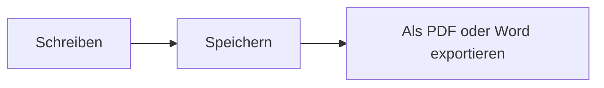

# MDFlash-Kurzanleitung

MDFlash verwandelt Markdown **beim Schreiben** in formatierten Text: Es gibt keine getrennte Vorschau, der Text nimmt sofort Gestalt an. Diese Anleitung ist ein ganz normales Dokument: Sie können sie bearbeiten und darin üben.

## Die Grundlagen

| Sie tippen | Sie erhalten |
| --- | --- |
| `# Überschrift` (1 bis 6 Rauten) | eine Überschrift dieser Ebene |
| `**fett**` | **fett** |
| `*kursiv*` | *kursiv* |
| `~~durchgestrichen~~` | ~~durchgestrichen~~ |
| `==hervorgehoben==` | ==hervorgehoben== |
| `` `Code` `` | `Code` |
| `[Text](https://beispiel.de)` | einen Link |
| `> Zitat` | ein Zitat |
| `---` | eine horizontale Linie |

Drücken Sie **/** am Anfang einer leeren Zeile, um das Einfügemenü zu öffnen: Überschriften, Listen, Tabellen, Formeln, Diagramme, Bilder und Fußnoten.

Markieren Sie Text, um die Formatierungsleiste anzuzeigen.

## Listen

- Beginnen Sie eine Zeile mit `-` und einem Leerzeichen für eine Aufzählung
- `1.` und ein Leerzeichen für eine nummerierte Liste
  - Tab zum Einrücken, Umschalt+Tab zum Zurücksetzen

- [x] `- [ ]` erstellt eine Aufgabenliste
- [ ] klicken Sie auf das Kästchen, um es abzuhaken

## Tabellen

Tippen Sie `|Name|Rolle|` und drücken Sie die Eingabetaste, oder verwenden Sie **Strg+T**. Beim Überfahren der Tabelle erscheinen Steuerelemente zum Hinzufügen, Verschieben und Ausrichten von Zeilen und Spalten.

| Werkzeug | Wozu es dient |
| :-- | :-- |
| Strg+T | Tabelle einfügen |
| Tab | zur nächsten Zelle |

## Formeln

Formel im Text: $E = mc^2$, oder in einer eigenen Zeile mit `$$` und Eingabetaste:

$$
\int_0^1 x^2\,dx = \frac{1}{3}
$$

## Diagramme

Ein Codeblock mit der Sprache `mermaid` wird zu einem Diagramm:



## Code

```js
// Syntaxhervorhebung für über 100 Sprachen
function gruessen(name) {
  return `Hallo, ${name}!`;
}
```

## Bilder

Fügen Sie ein Bild ein (Strg+V) oder ziehen Sie es ins Fenster: Es wird in den Ordner `assets` neben dem Dokument kopiert und mit einem relativen Pfad eingefügt, damit das Dokument portabel bleibt. Den Ordner ändern Sie in den Einstellungen.

## Fußnoten

Markdown unterstützt Fußnoten[^1]: Verwenden Sie Absatz > Fußnote.

[^1]: Wie diese hier.

## Nützliche Tastenkombinationen

| Aktion | Tasten |
| --- | --- |
| Dokument schnell öffnen | Strg+P |
| Befehlspalette | Strg+Umschalt+A |
| Quelltextmodus (reines Markdown) | Strg+U |
| Fokusmodus | F8 |
| Schreibmaschinenmodus | F9 |
| Suchen / Ersetzen | Strg+F / Strg+H |
| Im ganzen Ordner suchen | Strg+Umschalt+F |
| Seitenleiste | Strg+Umschalt+L |
| Schreibassistent (Ollama) | Strg+J |
| Überschrift 1-6, Absatz | Strg+1 … Strg+6, Strg+0 |
| Aufzählung, nummerierte Liste, Aufgabenliste | Strg+Umschalt+8, 7, 9 |

Die vollständige Liste finden Sie unter **Hilfe > Tastenkombinationen**.

## Mehr als Typora

- **Tabs**: mehrere Dokumente im selben Fenster (Strg+Tab zum Wechseln).
- **Versionsverlauf**: Jedes Speichern behält eine Kopie; unter *Datei > Versionsverlauf* sehen Sie die Unterschiede und können zurückgehen.
- **Automatische Wiederherstellung**: Wenn der PC plötzlich ausgeht, finden Sie den ungespeicherten Text beim Neustart wieder.
- **Ordnersuche**: Suchen Sie ein Wort in allen Dokumenten eines Ordners.
- **[[Wiki-Links]]**: kompatibel mit Obsidian-Vaults; Strg+Klick öffnet die Notiz.
- **Lokaler Assistent**: Mit installiertem [Ollama](https://ollama.com) korrigieren, übersetzen, zusammenfassen oder umschreiben, ohne den Text ins Internet zu senden.
- **Word-Export** auch ohne Zusatzprogramme.
- **Neun Sprachen**: Ansicht > Sprache.
