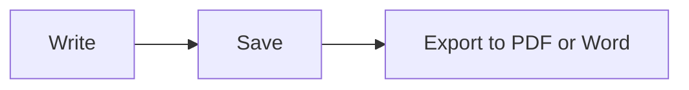

# MDFlash quick guide

MDFlash turns Markdown into formatted text **as you type**: there is no separate preview, the text takes shape right away. This guide is a document like any other, so feel free to edit it and experiment.

## The basics

| Type | You get |
| --- | --- |
| `# Heading` (1 to 6 hash signs) | a heading of that level |
| `**bold**` | **bold** |
| `*italic*` | *italic* |
| `~~strikethrough~~` | ~~strikethrough~~ |
| `==highlight==` | ==highlight== |
| `` `code` `` | `code` |
| `[text](https://example.com)` | a link |
| `> quote` | a quote |
| `---` | a horizontal rule |

Press **/** at the start of an empty line to open the insert menu: headings, lists, tables, math, diagrams, images and footnotes.

Select some text to show the formatting toolbar.

## Lists

- Start a line with `-` and a space for a bulleted list
- `1.` and a space for a numbered list
  - Tab to indent, Shift+Tab to go back

- [x] `- [ ]` creates a task list
- [ ] click the box to tick it

## Tables

Type `|Name|Role|` and press Enter, or use **Ctrl+T**. Hovering over the table shows the controls to add, move and align rows and columns.

| Tool | What it does |
| :-- | :-- |
| Ctrl+T | insert a table |
| Tab | go to the next cell |

## Math

Inline math: $E = mc^2$, or on its own line with `$$` and Enter:

$$
\int_0^1 x^2\,dx = \frac{1}{3}
$$

## Diagrams

A code block with the `mermaid` language becomes a diagram:



## Code

```js
// Syntax highlighting for more than 100 languages
function greet(name) {
  return `Hello, ${name}!`;
}
```

## Images

Paste an image (Ctrl+V) or drop it into the window: it is copied to the `assets` folder next to the document and inserted with a relative path, so the document stays portable. You can change the folder in Preferences.

## Footnotes

Markdown supports footnotes[^1]: use Paragraph > Footnote.

[^1]: Like this one.

## Useful shortcuts

| Action | Keys |
| --- | --- |
| Quick open a document | Ctrl+P |
| Command palette | Ctrl+Shift+A |
| Source mode (raw Markdown) | Ctrl+U |
| Focus mode | F8 |
| Typewriter mode | F9 |
| Find / Replace | Ctrl+F / Ctrl+H |
| Search the whole folder | Ctrl+Shift+F |
| Sidebar | Ctrl+Shift+L |
| Writing assistant (Ollama) | Ctrl+J |
| Heading 1-6, paragraph | Ctrl+1 … Ctrl+6, Ctrl+0 |
| Bulleted, numbered, task list | Ctrl+Shift+8, 7, 9 |

The full list is in **Help > Keyboard Shortcuts**.

## Beyond Typora

- **Tabs**: several documents in the same window (Ctrl+Tab to switch).
- **Version history**: every save keeps a copy; in *File > Version History* you see the differences and can go back.
- **Automatic recovery**: if the PC shuts down suddenly, your unsaved text is there when you restart.
- **Folder search**: find a word inside every document in a folder.
- **[[Wiki links]]**: compatible with Obsidian vaults; Ctrl+click opens the note.
- **Local assistant**: with [Ollama](https://ollama.com) installed, fix, translate, summarize or rewrite text without sending it to the Internet.
- **Word export** even without extra programs.
- **Nine languages**: View > Language.
