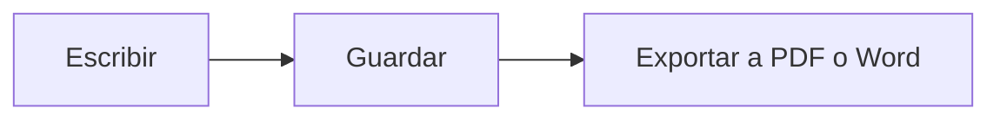

# Guía rápida de MDFlash

MDFlash convierte el Markdown en texto con formato **mientras escribes**: no hay vista previa aparte, el texto toma forma al instante. Esta guía es un documento como cualquier otro: puedes modificarla y practicar con ella.

## Lo básico

| Escribes | Obtienes |
| --- | --- |
| `# Título` (de 1 a 6 almohadillas) | un título de ese nivel |
| `**negrita**` | **negrita** |
| `*cursiva*` | *cursiva* |
| `~~tachado~~` | ~~tachado~~ |
| `==resaltado==` | ==resaltado== |
| `` `código` `` | `código` |
| `[texto](https://ejemplo.es)` | un enlace |
| `> cita` | una cita |
| `---` | una línea horizontal |

Pulsa **/** al principio de una línea vacía para abrir el menú de inserción: títulos, listas, tablas, fórmulas, diagramas, imágenes y notas.

Selecciona texto para mostrar la barra de formato.

## Listas

- Empieza una línea con `-` y un espacio para una lista con viñetas
- `1.` y un espacio para una lista numerada
  - Tab para aumentar la sangría, Mayús+Tab para reducirla

- [x] `- [ ]` crea una lista de tareas
- [ ] haz clic en la casilla para marcarla

## Tablas

Escribe `|Nombre|Función|` y pulsa Intro, o usa **Ctrl+T**. Al pasar el ratón sobre la tabla aparecen los controles para añadir, mover y alinear filas y columnas.

| Herramienta | Para qué sirve |
| :-- | :-- |
| Ctrl+T | insertar una tabla |
| Tab | pasar a la celda siguiente |

## Fórmulas

Fórmula en línea: $E = mc^2$, o en su propia línea con `$$` e Intro:

$$
\int_0^1 x^2\,dx = \frac{1}{3}
$$

## Diagramas

Un bloque de código con el lenguaje `mermaid` se convierte en un diagrama:



## Código

```js
// Resaltado de sintaxis para más de 100 lenguajes
function saludar(nombre) {
  return `¡Hola, ${nombre}!`;
}
```

## Imágenes

Pega una imagen (Ctrl+V) o arrástrala a la ventana: se copia en la carpeta `assets` junto al documento y se inserta con una ruta relativa, así el documento sigue siendo portátil. La carpeta se cambia en Preferencias.

## Notas al pie

Markdown admite notas al pie[^1]: usa Párrafo > Nota al pie.

[^1]: Como esta.

## Atajos útiles

| Acción | Teclas |
| --- | --- |
| Apertura rápida de un documento | Ctrl+P |
| Paleta de comandos | Ctrl+Shift+A |
| Modo código fuente (Markdown sin formato) | Ctrl+U |
| Modo concentración | F8 |
| Modo máquina de escribir | F9 |
| Buscar / Reemplazar | Ctrl+F / Ctrl+H |
| Buscar en toda la carpeta | Ctrl+Shift+F |
| Barra lateral | Ctrl+Shift+L |
| Asistente de escritura (Ollama) | Ctrl+J |
| Título 1-6, párrafo | Ctrl+1 … Ctrl+6, Ctrl+0 |
| Lista con viñetas, numerada, de tareas | Ctrl+Shift+8, 7, 9 |

La lista completa está en **Ayuda > Atajos de teclado**.

## Más allá de Typora

- **Pestañas**: varios documentos en la misma ventana (Ctrl+Tab para cambiar).
- **Historial de versiones**: cada guardado conserva una copia; en *Archivo > Historial de versiones* ves las diferencias y vuelves atrás.
- **Recuperación automática**: si el PC se apaga de repente, al reiniciar encuentras el texto sin guardar.
- **Búsqueda en la carpeta**: busca una palabra dentro de todos los documentos de una carpeta.
- **[[Enlaces wiki]]**: compatibles con las bóvedas de Obsidian; Ctrl+clic abre la nota.
- **Asistente local**: con [Ollama](https://ollama.com) instalado, corrige, traduce, resume o reescribe el texto sin enviarlo a Internet.
- **Exportación a Word** incluso sin programas adicionales.
- **Nueve idiomas**: Ver > Idioma.
