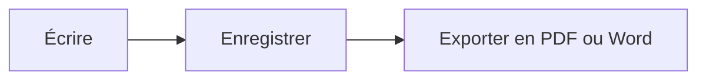

# Guide rapide de MDFlash

MDFlash transforme le Markdown en texte mis en forme **pendant que vous écrivez** : pas d'aperçu séparé, le texte prend forme tout de suite. Ce guide est un document comme les autres : vous pouvez le modifier et vous exercer dessus.

## Les bases

| Vous tapez | Vous obtenez |
| --- | --- |
| `# Titre` (de 1 à 6 dièses) | un titre de ce niveau |
| `**gras**` | **gras** |
| `*italique*` | *italique* |
| `~~barré~~` | ~~barré~~ |
| `==surligné==` | ==surligné== |
| `` `code` `` | `code` |
| `[texte](https://exemple.fr)` | un lien |
| `> citation` | une citation |
| `---` | une ligne horizontale |

Appuyez sur **/** au début d'une ligne vide pour ouvrir le menu d'insertion : titres, listes, tableaux, formules, diagrammes, images et notes.

Sélectionnez du texte pour afficher la barre de mise en forme.

## Listes

- Commencez une ligne par `-` et un espace pour une liste à puces
- `1.` et un espace pour une liste numérotée
  - Tab pour augmenter le retrait, Maj+Tab pour revenir

- [x] `- [ ]` crée une liste de tâches
- [ ] cliquez sur la case pour la cocher

## Tableaux

Tapez `|Nom|Rôle|` puis Entrée, ou utilisez **Ctrl+T**. En survolant le tableau, des commandes apparaissent pour ajouter, déplacer et aligner lignes et colonnes.

| Outil | À quoi il sert |
| :-- | :-- |
| Ctrl+T | insérer un tableau |
| Tab | passer à la cellule suivante |

## Formules

Formule en ligne : $E = mc^2$, ou sur sa propre ligne avec `$$` puis Entrée :

$$
\int_0^1 x^2\,dx = \frac{1}{3}
$$

## Diagrammes

Un bloc de code avec le langage `mermaid` devient un diagramme :



## Code

```js
// Coloration syntaxique pour plus de 100 langages
function saluer(nom) {
  return `Bonjour, ${nom} !`;
}
```

## Images

Collez une image (Ctrl+V) ou déposez-la dans la fenêtre : elle est copiée dans le dossier `assets` à côté du document et insérée avec un chemin relatif, le document reste donc portable. Le dossier se change dans les Préférences.

## Notes de bas de page

Le Markdown accepte les notes[^1] : utilisez Paragraphe > Note de bas de page.

[^1]: Comme celle-ci.

## Raccourcis utiles

| Action | Touches |
| --- | --- |
| Ouverture rapide d'un document | Ctrl+P |
| Palette de commandes | Ctrl+Shift+A |
| Mode source (Markdown brut) | Ctrl+U |
| Mode concentration | F8 |
| Mode machine à écrire | F9 |
| Rechercher / Remplacer | Ctrl+F / Ctrl+H |
| Rechercher dans tout le dossier | Ctrl+Shift+F |
| Barre latérale | Ctrl+Shift+L |
| Assistant d'écriture (Ollama) | Ctrl+J |
| Titre 1-6, paragraphe | Ctrl+1 … Ctrl+6, Ctrl+0 |
| Liste à puces, numérotée, de tâches | Ctrl+Shift+8, 7, 9 |

La liste complète se trouve dans **Aide > Raccourcis clavier**.

## Au-delà de Typora

- **Onglets** : plusieurs documents dans la même fenêtre (Ctrl+Tab pour passer de l'un à l'autre).
- **Historique des versions** : chaque enregistrement garde une copie ; dans *Fichier > Historique des versions* vous voyez les différences et revenez en arrière.
- **Récupération automatique** : si le PC s'éteint brusquement, vous retrouvez le texte non enregistré au redémarrage.
- **Recherche dans le dossier** : cherchez un mot dans tous les documents d'un dossier.
- **[[Liens wiki]]** : compatibles avec les coffres Obsidian ; Ctrl+clic ouvre la note.
- **Assistant local** : avec [Ollama](https://ollama.com) installé, corrigez, traduisez, résumez ou réécrivez le texte sans l'envoyer sur Internet.
- **Export Word** même sans programme supplémentaire.
- **Neuf langues** : Affichage > Langue.
