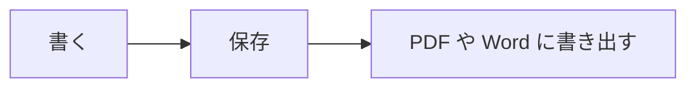

# MDFlash クイック ガイド

MDFlash は、**入力するそばから** Markdown を書式付きのテキストに変えます。別のプレビューはなく、文章はその場で形になります。このガイドも普通のドキュメントなので、自由に編集して練習してください。

## 基本

| 入力 | 結果 |
| --- | --- |
| `# 見出し` (# は 1〜6 個) | そのレベルの見出し |
| `**太字**` | **太字** |
| `*斜体*` | *斜体* |
| `~~取り消し線~~` | ~~取り消し線~~ |
| `==ハイライト==` | ==ハイライト== |
| `` `コード` `` | `コード` |
| `[テキスト](https://example.jp)` | リンク |
| `> 引用` | 引用 |
| `---` | 水平線 |

空の行の先頭で **/** を押すと挿入メニューが開きます: 見出し、リスト、表、数式、図、画像、脚注。

テキストを選択すると書式ツールバーが表示されます。

## リスト

- 行頭に `-` とスペースで箇条書き
- `1.` とスペースで番号付きリスト
  - Tab でインデント、Shift+Tab で戻す

- [x] `- [ ]` でタスク リストを作成
- [ ] ボックスをクリックするとチェックできます

## 表

`|名前|役割|` と入力して Enter を押すか、**Ctrl+T** を使います。表にマウスを合わせると、行と列の追加・移動・配置のボタンが表示されます。

| ツール | 用途 |
| :-- | :-- |
| Ctrl+T | 表を挿入 |
| Tab | 次のセルへ移動 |

## 数式

インライン数式: $E = mc^2$。独立した行にするには `$$` と Enter:

$$
\int_0^1 x^2\,dx = \frac{1}{3}
$$

## 図

言語を `mermaid` にしたコード ブロックは図になります:



## コード

```js
// 100 以上の言語に対応したシンタックス ハイライト
function greet(name) {
  return `こんにちは、${name}さん!`;
}
```

## 画像

画像を貼り付ける (Ctrl+V) かウィンドウにドロップすると、ドキュメントの隣の `assets` フォルダーにコピーされ、相対パスで挿入されます。そのためドキュメントを別の場所へ持ち運べます。フォルダーは設定で変更できます。

## 脚注

Markdown では脚注[^1]が使えます: [段落] > [脚注] を使ってください。

[^1]: このような脚注です。

## 便利なショートカット

| 操作 | キー |
| --- | --- |
| ドキュメントのクイック オープン | Ctrl+P |
| コマンド パレット | Ctrl+Shift+A |
| ソース モード (生の Markdown) | Ctrl+U |
| フォーカス モード | F8 |
| タイプライター モード | F9 |
| 検索 / 置換 | Ctrl+F / Ctrl+H |
| フォルダー全体を検索 | Ctrl+Shift+F |
| サイドバー | Ctrl+Shift+L |
| 文章アシスタント (Ollama) | Ctrl+J |
| 見出し 1〜6、段落 | Ctrl+1 … Ctrl+6、Ctrl+0 |
| 箇条書き、番号付き、タスク リスト | Ctrl+Shift+8、7、9 |

全一覧は **[ヘルプ] > [キーボード ショートカット]** にあります。

## Typora を超える機能

- **タブ**: 1 つのウィンドウで複数のドキュメント (Ctrl+Tab で切り替え)。
- **バージョン履歴**: 保存のたびにコピーを保持。[ファイル] > [バージョン履歴] で差分を確認して元に戻せます。
- **自動復元**: PC が突然終了しても、再起動すると未保存のテキストが戻ります。
- **フォルダー検索**: フォルダー内のすべてのドキュメントから単語を探せます。
- **[[ウィキリンク]]**: Obsidian の保管庫と互換。Ctrl+クリックでノートを開きます。
- **ローカル アシスタント**: [Ollama](https://ollama.com) があれば、文章をインターネットに送らずに校正・翻訳・要約・書き直しができます。
- **Word への書き出し**: 追加のプログラムなしで可能。
- **9 か国語**: [表示] > [言語]。
