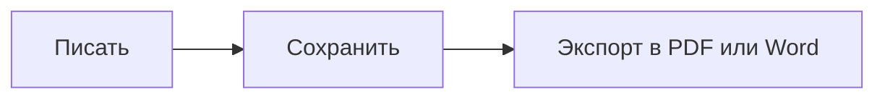

# Краткое руководство по MDFlash

MDFlash превращает Markdown в оформленный текст **прямо во время набора**: отдельного предпросмотра нет, текст сразу принимает нужный вид. Это руководство является обычным документом, как и любой другой: его можно править и тренироваться на нём.

## Основы

| Вы пишете | Вы получаете |
| --- | --- |
| `# Заголовок` (от 1 до 6 решёток) | заголовок соответствующего уровня |
| `**жирный**` | **жирный** |
| `*курсив*` | *курсив* |
| `~~зачёркнутый~~` | ~~зачёркнутый~~ |
| `==выделение==` | ==выделение== |
| `` `код` `` | `код` |
| `[текст](https://example.ru)` | ссылку |
| `> цитата` | цитату |
| `---` | горизонтальную линию |

Нажмите **/** в начале пустой строки, чтобы открыть меню вставки: заголовки, списки, таблицы, формулы, диаграммы, изображения и сноски.

Выделите текст, чтобы появилась панель форматирования.

## Списки

- Начните строку с `-` и пробела для маркированного списка
- `1.` и пробел для нумерованного списка
  - Tab увеличивает отступ, Shift+Tab возвращает назад

- [x] `- [ ]` создаёт список задач
- [ ] щёлкните по квадратику, чтобы отметить пункт

## Таблицы

Наберите `|Имя|Роль|` и нажмите Enter или используйте **Ctrl+T**. При наведении на таблицу появляются кнопки для добавления, перемещения и выравнивания строк и столбцов.

| Инструмент | Назначение |
| :-- | :-- |
| Ctrl+T | вставить таблицу |
| Tab | перейти к следующей ячейке |

## Формулы

Формула в строке: $E = mc^2$, а на отдельной строке через `$$` и Enter:

$$
\int_0^1 x^2\,dx = \frac{1}{3}
$$

## Диаграммы

Блок кода с языком `mermaid` превращается в диаграмму:



## Код

```js
// Подсветка синтаксиса для более чем 100 языков
function greet(name) {
  return `Привет, ${name}!`;
}
```

## Изображения

Вставьте изображение (Ctrl+V) или перетащите его в окно: оно копируется в папку `assets` рядом с документом и вставляется по относительному пути, поэтому документ остаётся переносимым. Папку можно изменить в настройках.

## Сноски

Markdown поддерживает сноски[^1]: используйте Абзац > Сноска.

[^1]: Вот такие.

## Полезные сочетания клавиш

| Действие | Клавиши |
| --- | --- |
| Быстрое открытие документа | Ctrl+P |
| Палитра команд | Ctrl+Shift+A |
| Режим исходного кода (чистый Markdown) | Ctrl+U |
| Режим концентрации | F8 |
| Режим печатной машинки | F9 |
| Найти / Заменить | Ctrl+F / Ctrl+H |
| Поиск по всей папке | Ctrl+Shift+F |
| Боковая панель | Ctrl+Shift+L |
| Помощник для письма (Ollama) | Ctrl+J |
| Заголовок 1-6, абзац | Ctrl+1 … Ctrl+6, Ctrl+0 |
| Маркированный, нумерованный список, список задач | Ctrl+Shift+8, 7, 9 |

Полный список находится в разделе **Справка > Сочетания клавиш**.

## Больше, чем Typora

- **Вкладки**: несколько документов в одном окне (Ctrl+Tab для переключения).
- **История версий**: при каждом сохранении остаётся копия; в *Файл > История версий* видны различия и можно вернуться назад.
- **Автовосстановление**: если компьютер внезапно выключится, после перезапуска несохранённый текст вернётся.
- **Поиск по папке**: найдите слово во всех документах папки.
- **[[Вики-ссылки]]**: совместимы с хранилищами Obsidian; Ctrl+щелчок открывает заметку.
- **Локальный помощник**: с установленной [Ollama](https://ollama.com) можно исправлять, переводить, сокращать и переписывать текст, не отправляя его в Интернет.
- **Экспорт в Word** даже без дополнительных программ.
- **Девять языков**: Вид > Язык.
