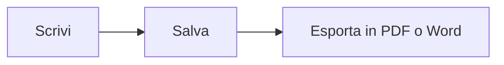

# Guida rapida a MDFlash

MDFlash trasforma il Markdown **mentre scrivi**: niente anteprima a parte, il testo prende forma subito. Questa guida è un documento come gli altri, puoi modificarla e provarci sopra.

## Le basi

| Scrivi | Ottieni |
| --- | --- |
| `# Titolo` (da 1 a 6 cancelletti) | un titolo del livello corrispondente |
| `**grassetto**` | **grassetto** |
| `*corsivo*` | *corsivo* |
| `~~barrato~~` | ~~barrato~~ |
| `==evidenziato==` | ==evidenziato== |
| `` `codice` `` | `codice` |
| `[testo](https://esempio.it)` | un collegamento |
| `> citazione` | una citazione |
| `---` | una linea orizzontale |

Premi **/** all'inizio di una riga vuota per il menu di inserimento: titoli, elenchi, tabelle, formule, diagrammi, immagini e note.

Seleziona del testo per far comparire la barra di formattazione.

## Elenchi

- Inizia una riga con `-` e uno spazio per un elenco puntato
- `1.` e uno spazio per un elenco numerato
  - Tab per rientrare, Maiusc+Tab per tornare indietro

- [x] `- [ ]` crea un elenco di attività
- [ ] clicca sulla casella per spuntarla

## Tabelle

Scrivi `|Nome|Ruolo|` e premi Invio, oppure usa **Ctrl+T**. Con il mouse sopra la tabella compaiono i controlli per aggiungere, spostare e allineare righe e colonne.

| Strumento | A cosa serve |
| :-- | :-- |
| Ctrl+T | inserire una tabella |
| Tab | passare alla cella successiva |

## Formule

Formula nella riga: $E = mc^2$, oppure su una riga sua con `$$` e Invio:

$$
\int_0^1 x^2\,dx = \frac{1}{3}
$$

## Diagrammi

Un blocco di codice con linguaggio `mermaid` diventa un diagramma:



## Codice

```js
// Evidenziazione della sintassi per oltre 100 linguaggi
function saluta(nome) {
  return `Ciao, ${nome}!`;
}
```

## Immagini

Incolla un'immagine (Ctrl+V) o trascinala nella finestra: viene copiata nella cartella `assets` accanto al documento e inserita con un percorso relativo, così il documento resta portabile. La cartella si cambia nelle Preferenze.

## Note a piè di pagina

Il Markdown ammette le note[^1]: usa il menu Paragrafo > Nota a piè di pagina.

[^1]: Come questa.

## Scorciatoie utili

| Azione | Tasti |
| --- | --- |
| Apertura rapida di un documento | Ctrl+P |
| Tavolozza dei comandi | Ctrl+Shift+A |
| Modalità sorgente (Markdown grezzo) | Ctrl+U |
| Modalità concentrazione | F8 |
| Modalità macchina da scrivere | F9 |
| Trova / Sostituisci | Ctrl+F / Ctrl+H |
| Cerca in tutta la cartella | Ctrl+Shift+F |
| Barra laterale | Ctrl+Shift+L |
| Assistente di scrittura (Ollama) | Ctrl+J |
| Titolo 1-6, paragrafo | Ctrl+1 … Ctrl+6, Ctrl+0 |
| Elenco puntato, numerato, attività | Ctrl+Shift+8, 7, 9 |

L'elenco completo è in **Aiuto > Scorciatoie da tastiera**.

## Oltre Typora

- **Schede**: più documenti nella stessa finestra (Ctrl+Tab per passare dall'uno all'altro).
- **Cronologia delle versioni**: ogni salvataggio conserva una copia; da *File > Cronologia delle versioni* vedi le differenze e torni indietro.
- **Recupero automatico**: se il PC si spegne all'improvviso, al riavvio ritrovi il testo non salvato.
- **Ricerca nella cartella**: cerca una parola dentro tutti i documenti di una cartella.
- **Assistente locale**: con [Ollama](https://ollama.com) installato, correggi, traduci, riassumi o riscrivi il testo senza mandarlo su Internet.
- **[[Wikilink]]**: compatibili con gli archivi di Obsidian; Ctrl+clic apre la nota.
- **Esportazione in Word** anche senza programmi aggiuntivi.
- **Nove lingue**: Vista > Lingua.
